Create Sagemaker machine learning pipeline for multi-tenant environment

## Business use case

This solution is for customers who want to securely build, train, and deploy multi-tenant machine learning models. It shows how to build machine learning models, considering data and model isolation and how to deploy and maintain trained models independently per tenant. This solution is suitable for Data Engineers and MLOps.

Many customers are dealing with multi-tenant environment. They obtain data from customers, train models, and deploy in independent environment. A typical Machine Learning pipeline involves a series of steps to build a single use model from a predefined set of product features. Yet for most customers, they need to build models for hundreds of thousands of their customers who have very different behaviors and data. They face many challenges in creating such multi-tenant pipeline, in term of governance and security.

## Architecture

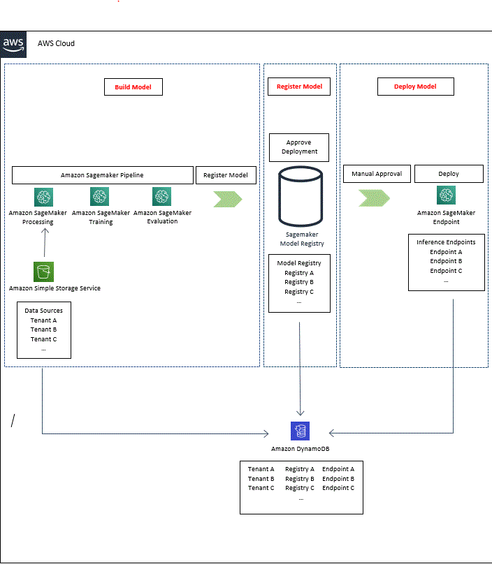   

## CDK project structure :

The solution comprised of a cdk stack.

•	Single-account-MulitenantSagemakerStack : 

Creates AWS Step Functions to create and delete tenant artifacts, deploy Sagemaker endpoint; 

Creates Amazon Sagemaker pipeline to process, train, evaluate, and register models; 

Creates IAM roles required for executing AWS Step Functions and Amazon Sagemaker pipeline, accessing S3 and DynamoDB.

Pre-requisites

•	AWS CLI >= 2.2.25 (Please follow Installing or updating the latest version of the AWS CLI guide to install/upgrade AWS CLI)

•	AWS CDK command line utility (2.20.0) (Please follow Getting started with the AWS CDK guide to install/upgrade cdk.)

•	Python>=3.7

•	Amazon Sagemaker domain (Please follow Onboard to Amazon SageMaker Domain to create a domain; You do not need RStudio.)

Note: You can deploy this stack in your select AWS account and region.

### Steps to deploy the project

1.	Clone the repository.

   `$ git clone https://github.com/aws-samples/multitenant-sagemaker.git`

2.	This project is set up like a standard Python project. To create the virtualenv it assumes that there is a python3 (or python for Windows) executable in your path with access to the venv package. create the virtualenv using following command.

   `$ python3 -m venv .venv` 

3.	Use the following step to activate your virtualenv.

   `$ source .venv/bin/activate`

If you are a Windows platform, you would activate the virtualenv like this:

   `% .venv\Scripts\activate.bat`

Once the virtualenv is activated, you can install the required dependencies.

   `$ pip install -r requirements.txt`

4.	Run the following command to bootstrap the environment, replacing all <> occurences with select AWS account and region.

   `$ cdk bootstrap aws://<aws-account>/<region> -c table_name=allTenants`

5.	Deploying the solution :

Deploying new stack with defined IAM Roles : Execute following command by passing a required parameter of DynamoDB table name.

   `$ cdk deploy Single-account-MultitenantSagemakerStack -c table_name=allTenants`

Arguments to the stack creation :

•	Table_name : (Required) Name of the DynamoDB table. This table stores tenant metadata.

Note : Please note that this deployment takes approximately 3 minutes.

After the stack is succefully deployed (You can see if there is an error as the cdk output, otherwise the stack is creation successful), please open the AWS Step Functions to execute steps 1-8, as instructed below.

   
 
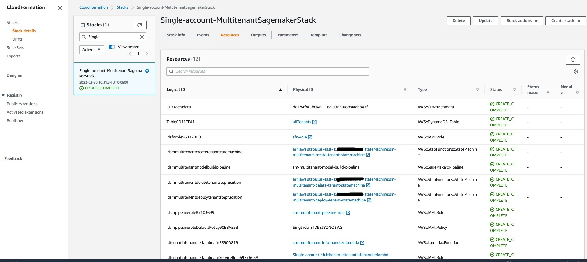 

### Steps to test the solution

•	Step 1 : In Step Function, execute Create Step Function sm-multitenant-create-tenant-statemachine to create tenant bucket, model registry group, and update tenant metadata in allTenants DynamoDB table. Follow the Input JSON format below, replacing tenant's name (same as bucket's name, i.e. "ut-101") with a globally unique name. By default, the bucket being created will be blocked from public access.

{
    "tenant": {
      "name": "\<bucket-name\>"
    }
}

Note : Please note that this Create Step Function takes approximately less than a minute.

 
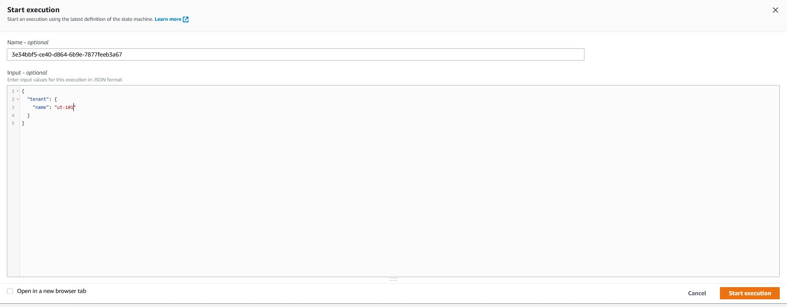 
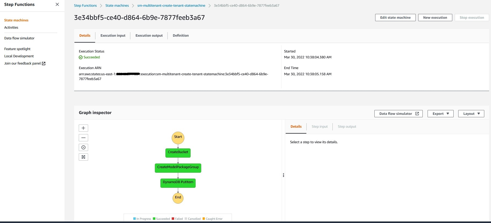 
 
•	Step 2 : Check S3, Sagemaker Studio, and DynamoDB for newly created bucket, model package group, and database entry. 

 

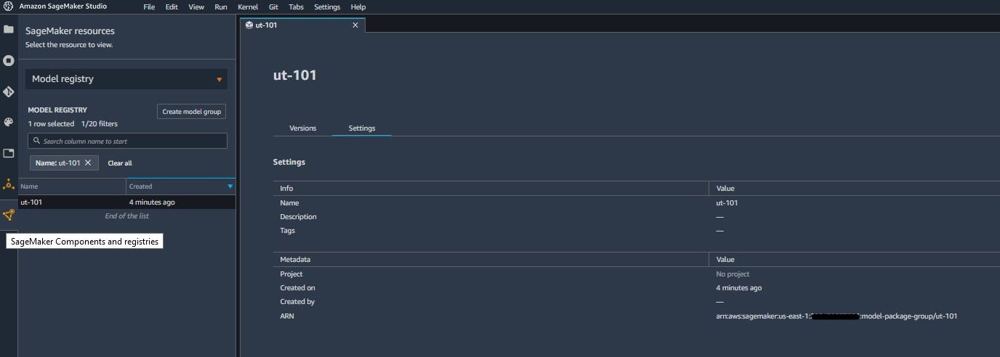
 
 
•	Step 3 : In S3, upload input data for machine learning pipeline. The input data, churn.txt, is located under multitenant-sagemaker/sample-data subfolder.

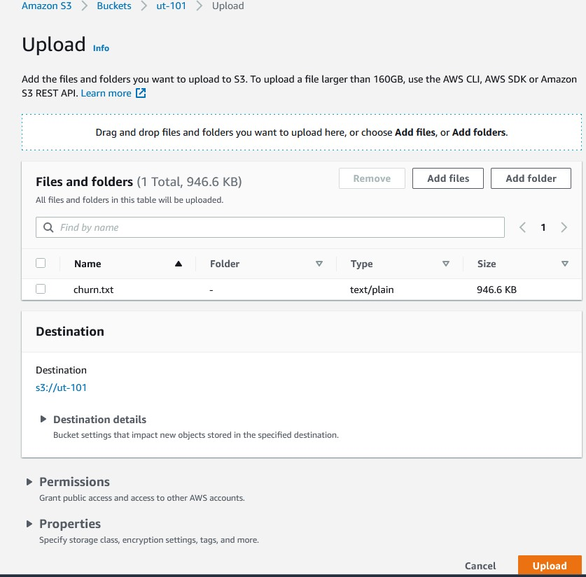 
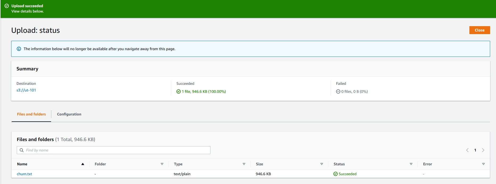 

•	Step 4 : In Sagemaker Studio, execute machine learning pipeline sm-multitenant-model-build-pipeline to generate multiple model versions.

Note : Please note that each machine learning pipeline takes approximately 15 minutes of processing, training, and evaluating. An individual step takes approximately 4-5 minutes.

  
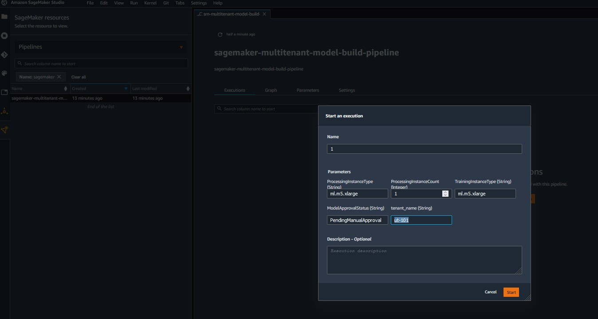
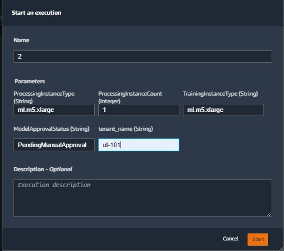

  
•	Step 5 : Manual approve a model version.

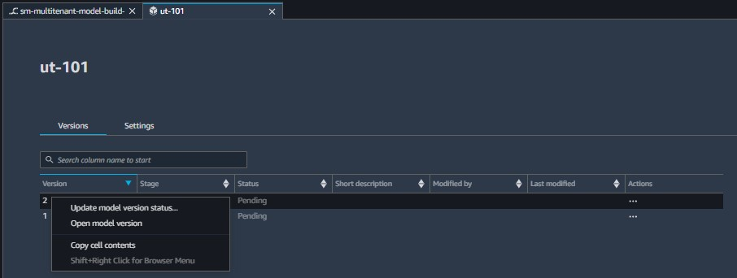
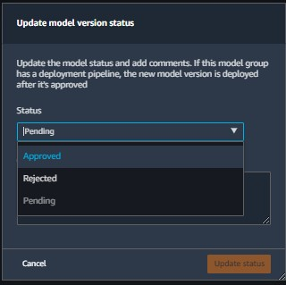

 
•	Step 6 : In Step Function, execute Deploy Step Function sm-multitenant-deploy-tenant-statemachine to create and test model endpoint of the approved version, then update tenant metadata in allTenants DynamoDB table. Follow the Input JSON format below, replacing tenant's name (same as bucket's name, i.e. "ut-101") and tenant's version with your defined tenant's name and the approved modelpackage ARN.

{
    "tenant": {
      "name": "\<bucket-name\>",
      "version": "arn:aws:sagemaker:\<region\>:\<aws-account\>:model-package/\<bucket-name\>/\<version\>"
    }
}

Note : Please note that this Deploy Step Function takes approximately 5 minutes.

 
 
 
 

•	Step 7 : Once the Deploy Step Function completes successfully, you will find an in-service model endpoint in Amazon Sagemaker Console, under Inference > Endpoints. You can further test and validate this endpoint. Note that the Deploy Step Function also ensures a success invoke-endpoint.

•	Step 8 : In case you need to clean up the, in Step Function, execute Delete Step Function to delete tenant resources and update the tenant metadata in allTenants DynamoDB table.

{
    "tenant": {
      "name": "\<bucket-name\>"
    }
}

Note : Please note that this Delete Step Function takes approximately 5 seconds.

 
 
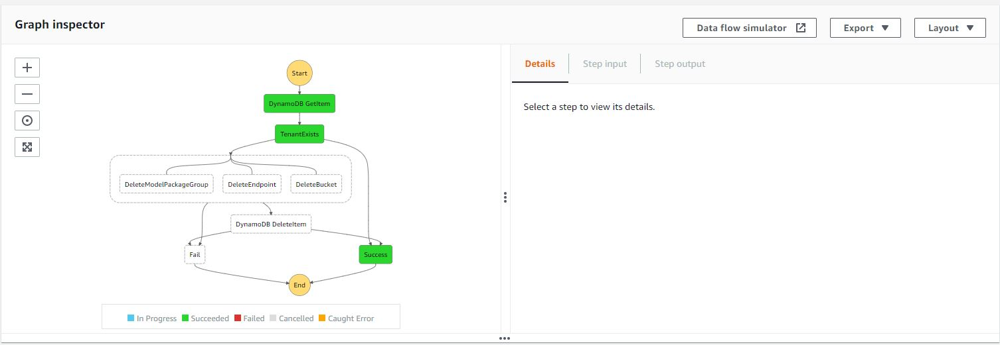 
 
### Clean up :

To avoid incurring ongoing costs, delete the resources you created as part of this solution bye executing following commands in order.

   $ cdk destroy Single-account-MultitenantSagemakerStack -c table_name=allTenants

Note : Please note that this clean-up takes approximately 2 minutes.

**Security**

See CONTRIBUTING for more information.

**License**

This library is licensed under the MIT-0 License. See the LICENSE file.
